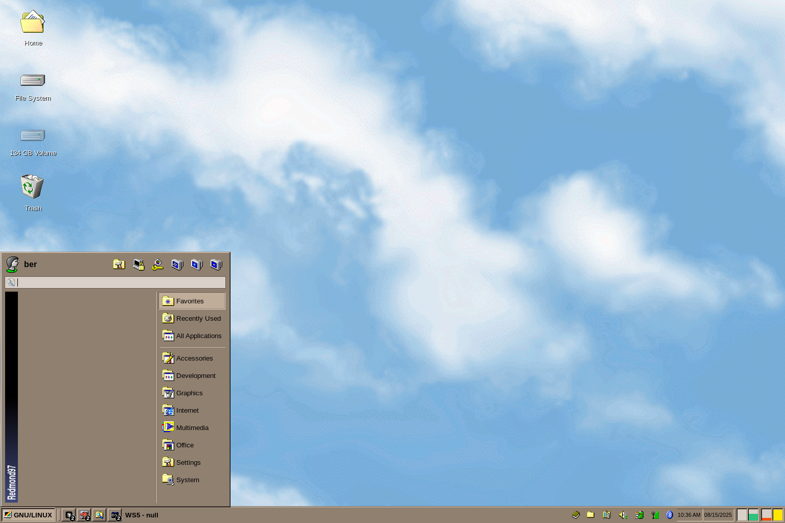

# Ber's Dotfiles

These are my personal configuration files for my GNU/Linux setup. I use a cursed combination of Hyprland and XFCE4 to create my desired retro desktop experience.

## Screenshots

Here are some screenshots of my desktop in action:

## Structure

This repository is organized into the following directories:

*   `colors/`: Color scheme details (Earthsong).
*   `firefox/`: Configuration for Firefox, including a custom theme and userChrome.css.
*   `gtk-3.0/`: GTK theme and icon settings.
*   `hypr/`: Configuration for the Hyprland Wayland compositor.
*   `screenshots/`: Screenshots of my desktop.
*   `wallpapers/`: My collection of wallpapers.
*   `xfce4/`: Configuration for the XFCE4 desktop environment.

## Details

### Colors

My color scheme is [Earthsong](https://github.com/Gogh-Co/Gogh/blob/master/themes/Earthsong.yml).
For more details, see the [colors/README.md](./colors/README.md).

### Firefox

My Firefox setup is customized for a minimal, keyboard-driven experience.

*   **Theme:** A custom version of "Earthsong".
*   **UI:** A modified `userChrome.css` inspired by qutebrowser (CREDIT: [Dook97](https://github.com/Dook97/firefox-qutebrowser-userchrome)).
*   **Extensions:** I use a variety of extensions for privacy, usability, and ad-blocking.

For more details, see the [firefox/README.md](./firefox/README.md).

### GTK

I use the following GTK theme and icons:

*   **Theme:** [Redmond97 Travel](https://github.com/matthewmx86/Redmond97/tree/master/Theme/csd/Redmond97%20Travel)
*   **Icons:** [SE98](https://github.com/nestoris/Win98SE)

For more details, see the [gtk-3.0/README.md](./gtk-3.0/README.md).

### Hyprland

I use Hyprland as my Wayland compositor. My configuration includes settings for:

*   Keybindings
*   Window rules
*   Aesthetics
*   Autostart applications
*   Idle management (`hypridle`)
*   Screen locking (`hyprlock`)
*   Color temperature (`hyprsunset`)

I also use a number of scripts to integrate Hyprland with my XFCE4 panel.

For more details, see the [hypr/README.md](./hypr/README.md).

### XFCE4

I use XFCE4 for my desktop environment, running it alongside Hyprland (slightly cursed). My configuration includes settings for:

*   The desktop itself
*   xfce4-panel
*   xfce4-terminal
*   Thunar
*   WhiskerMenu

For more details, see the [xfce4/README.md](./xfce4/README.md).

## Installation

To use these dotfiles, you will need to copy the configuration files to the appropriate locations in your home directory. Please see the individual README files for more detailed instructions.

## TODO:

* Add `.bashrc`
* Create install script
* Add helix + cursor configs
* Add llm cli stuff
* Finish VLC + Spotify configs

*Thanks for stopping by!*

