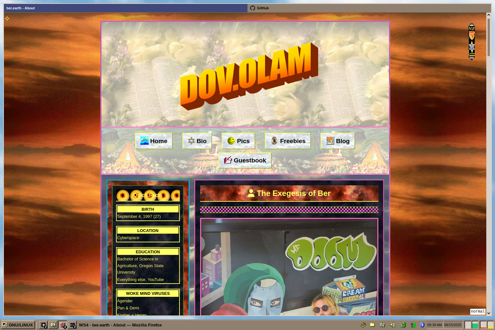

# Firefox Configuration

This directory contains my Firefox configuration, including a modified userChrome.css, my custom 'Earthsong' theme, and a full list of extensions.

## 1. UserChrome
- **Source**: Slightly modified from [Dook97's firefox-qutebrowser-userchrome](https://github.com/Dook97/firefox-qutebrowser-userchrome)
- **Purpose**: Implements a minimalist, keyboard-friendly interface inspired by qutebrowser
- **Includes**:
  - Tab bar adjustments
  - Navigation button modifications
  - Compact layout optimizations

## 2. Theme
- **Name**: Earthsong Custom
- **Tools**: Firefox Color + Custom Scrollbars (extensions)
- **Installation Steps**:
  1. Install the base theme directly via the provided `theme.xpi` file **OR** manually configure the theme by uploading `manifest.json` to Firefox Color
  2. Enable wide scrollbars and set the default width to 15 by [following these instructions](https://github.com/WesleyBranton/Custom-Scrollbar/wiki/How-to-enable-wide-scrollbars-on-Firefox)
  3. Restore `scrollbars.json` to the [Custom Scrollbars extension](https://github.com/WesleyBranton/Custom-Scrollbar)

## 3. Extensions
- **Firefox Color**: Tool for creating custom themes (see above)
- **Custom Scrollbars**: Tool for customizing scrollbars (see above)
- **Tridactyl**: A Vim-like interface for Firefox, inspired by Vimperator/Pentadactyl
  - **Modifications:**
    1. Restored Ctrl+F `:unbind <C-f>`
    2. Set custom start page `set newtab https://whatever`
- **uBlock Origin**: Makes the internet usable
- **Unhook**: Makes YouTube usable
- **SponsorBlock**: Skips sponsored segments on YouTube
- **Bypass Paywalls Clean**: You have to download this from Russia now ¯\_(ツ)_/¯
- **Consent-O-Matic**: Automatic handling of GDPR consent forms + cookies
- **Privacy Badger**: Automatically blocks hidden trackers
- **User Agent Switcher and Manager**: Pretend to be European for the GDPR perks 
