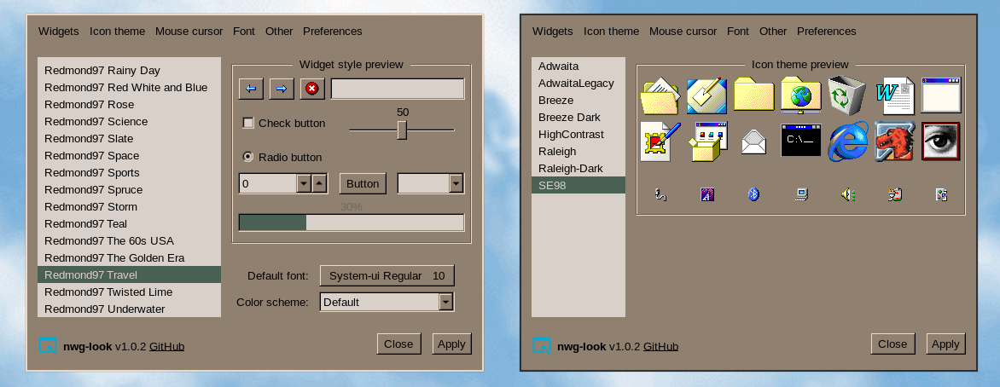

# GTK Settings

## Theme

I am using [Redmond97 Travel](https://github.com/matthewmx86/Redmond97/tree/master/Theme/csd/Redmond97%20Travel) by matthewmx86 as my GTK theme. It pairs nicely with [Earthsong](https://github.com/Gogh-Co/Gogh/blob/master/themes/Earthsong.yml).

## Icons
I am using [SE98](https://github.com/nestoris/Win98SE) by nestories.

## Font & Cursor
System-ui Regular 10 and Adwaita
