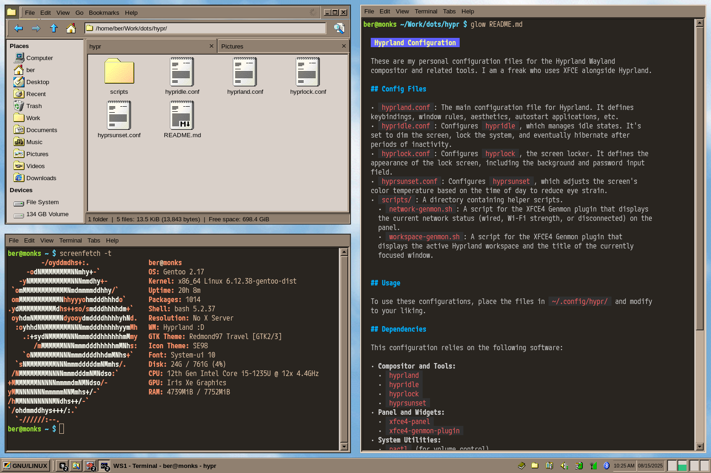

# Hyprland Configuration

These are my personal configuration files for the Hyprland Wayland compositor and related tools. I am a freak who uses XFCE alongside Hyprland.

## Config Files

-   `hyprland.conf`: The main configuration file for Hyprland. It defines keybindings, window rules, aesthetics, autostart applications, etc.
-   `hypridle-hibernate.conf`: Configures `hypridle` to lock the screen and hibernate the system after a short period of inactivity.
-   `hypridle-hibernate-ram.conf`: Configures `hypridle` to lock the screen and hibernate the system to RAM after a short period of inactivity.
-   `hypridle-focus.conf`: A `hypridle` configuration for 'focus' mode, which effectively disables idle-related actions.
-   `hyprlock.conf`: Configures `hyprlock`, the screen locker. It defines the appearance of the lock screen, including the background and password input field.
-   `hyprsunset.conf`: Configures `hyprsunset`, which adjusts the screen's color temperature based on the time of day to reduce eye strain.
-   `scripts/`: A directory containing helper scripts.
    -   `idle-toggle.sh`: A script for the XFCE4 Genmon plugin that toggles between the three `hypridle` profiles (hibernate, hibernate-ram, and focus).
    -   `network-genmon.sh`: A script for the XFCE4 Genmon plugin that displays the current network status (wired, Wi-Fi strength, or disconnected) on the panel.
    -   `workspace-genmon.sh`: A script for the XFCE4 Genmon plugin that displays the active Hyprland workspace and the title of the currently focused window.

## Usage

To use these configurations, place the files in `~/.config/hypr/` and modify to your liking. The `hypridle.conf` file is managed via the `scripts/idle-toggle.sh` script, which creates a symlink to one of the three idle profiles.

## Dependencies

This configuration relies on the following software:

-   **Compositor and Tools:**
    -   `hyprland`
    -   `hypridle`
    -   `hyprlock`
    -   `hyprsunset`
-   **Panel and Widgets:**
    -   `xfce4-panel`
    -   `xfce4-genmon-plugin`
-   **System Utilities:**
    -   `pactl` (for volume control)
    -   `light` (for screen brightness)
    -   `playerctl` (for media playback control)
    -   `grim` and `slurp` (for screenshots)
    -   `hyprpicker` (for color picking)
    -   `jq` (for JSON processing in scripts)
    -   `NetworkManager` (`nmcli`)
-   **Applications:**
    -   `catfish` (file search)
    -   `xfce4-dict` (dictionary)
    -   `nwg-look` (for GTK theme management)
    -   `xfce4-terminal`
    -   `thunar` (file manager)
    -   `xfce4-popup-whiskermenu`
