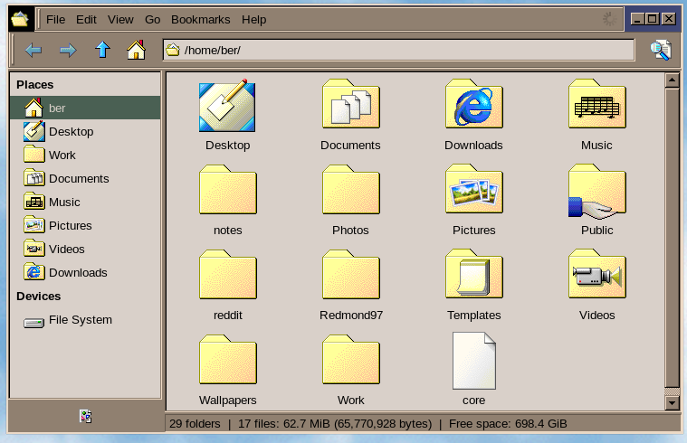

# XFCE4 Configuration

This directory contains my configuration files for the XFCE4 desktop environment (which I sadistically run alongside Hyprland).

## Desktop

Configuration for the XFCE4 desktop.

- **Configuration file:** `desktop/xfce4-desktop.xml`
- **Screenshot:**

## Panel

Configuration for the XFCE4 panel.

- **Configuration file:** `panel/xfce4-panel.xml`
- **Screenshot:**

## Terminal

Configuration for the XFCE4 terminal emulator.

- **Configuration file:** `terminal/terminalrc`
- **Color Scheme:** Earthsong
- **Font:** M+1 Code Nerd Font Mono Regular 12
- **Screenshot:**

## Thunar

Configuration for the Thunar file manager.

- **Configuration file:** `thunar/thunar.xml`
- **Screenshot:**

## Installation

To use these configuration files, you will need to copy them to the appropriate directories in your `~/.config/xfce4` directory.

For example, to use the panel configuration, you would copy `panel/xfce4-panel.xml` to `~/.config/xfce4/xfconf/xfce-perchannel-xml/xfce4-panel.xml`.

To run XFCE4 alongside hyprland just add `exec-once = xfce4=session` to your hyprland.conf.

**NOTE:** There's a bug with xfce4-popup-whiskermenu that requires killing and restarting xfce4-panel from your hyprland config in order to allow toggling the menu via a custom keybinding. This can be done with the following hack:

`exec-once = bash -c "sleep 2 && pkill xfce4-panel && xfce4-panel"`
