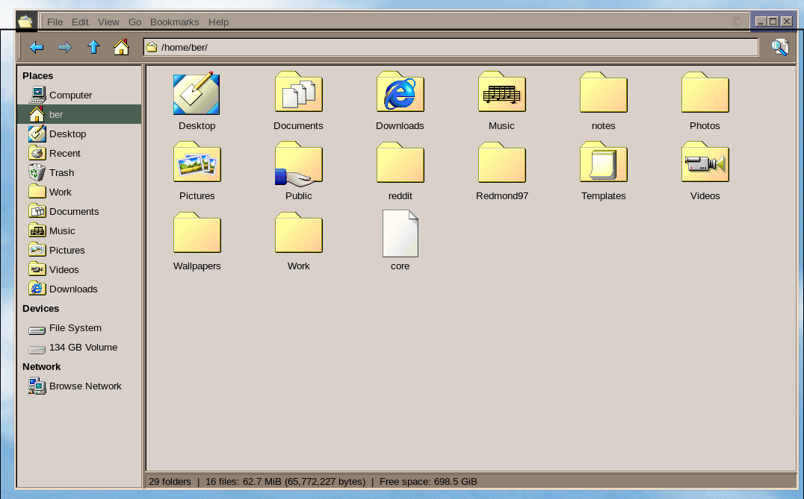

# Thunar

Pretty basic Thunar setup. Not much to say. GTK theme is [Redmond97 Travel](https://github.com/matthewmx86/Redmond97/tree/master/Theme/csd/Redmond97%20Travel) and Icons are [SE86](https://github.com/nestoris/Win98SE).