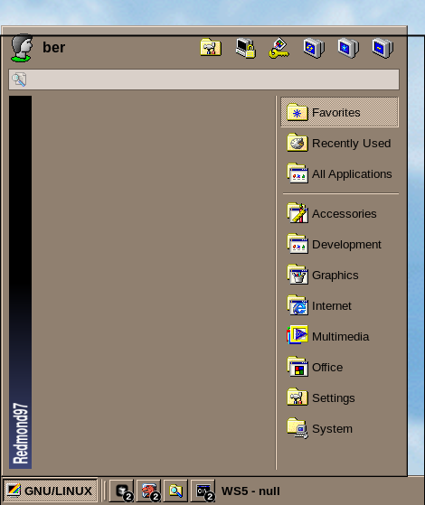

# XFCE4 WhiskerMenu


I have the following settings for WhiskerMenu.

## General
- Show as tree
- Show category names
- Show application tooltips
- Show application descriptions
- Icon size = `small`
- Category icon size = `smaller`
- Menu width = `450`
- Menu height = `500`
- Background opacity: `100`

## Appearance
- Profile = `Square Picture`
- Panel button title = `GNU/LINUX`
- Panel icon = `randr` (SE86)

## Behavior
- Default category = `favorites`
- Stay visible when focus is lost = `true`
- Sort categories = `true`
- Amount of items = `10`
- Show confirmation dialog = `true`

## Commands
- Settings Manager: `xfce4-settings-manager`
- Lock Screen: `hyprlock`
- Log Out: `hyprctl dispatch exit`
- Restart: `sudo reboot`
- Shut Down: `sudo shutdown -h now`
- Hibernate: `sudo hibernate`

**NOTE:** You must add the following to your /etc/sudoers for the above commands to work:

```bash
%wheel ALL=(ALL) NOPASSWD: /usr/sbin/xfpm-power-backlight-helper
%wheel ALL=(ALL) NOPASSWD: /usr/bin/hibernate
%wheel ALL=(ALL) NOPASSWD: /usr/bin/reboot
%wheel ALL=(ALL) NOPASSWD: /usr/bin/shutdown
```

## Search Actions
- Man Pages
  - Pattern: `!m`
  - Command: `exo-open --launch TerminalEmulator man %s`
- Search Google
  - Pattern: `!g`
  - Command: `exo-open --launch WebBrowser https://google.com/search?q=%u`
- Wikipedia
  - Pattern: `!w`
  - Command: `exo-open --launch WebBrowser https://en.wikipedia.org/wiki/%u`
- Run in Terminal
  - Pattern: `>`
  - Command: `xfce4-terminal -e "bash -c '%s; exec bash'"`
- Dictionary
  - Pattern: `!d`
  - Command: `xfce4-dict %s`
- Open WebUI
  - Pattern: `!o`
  - Command: `exo-open --launch WebBrowser https://<OWUI IP/URL>?q=%u`
- Perplexica
  - Pattern: `!a`
  - Command: `exo-open --launch WebBrowser https://<PERPLEXICA IP/URL>?q=%u`
